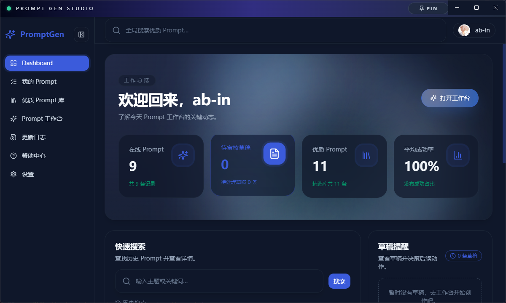
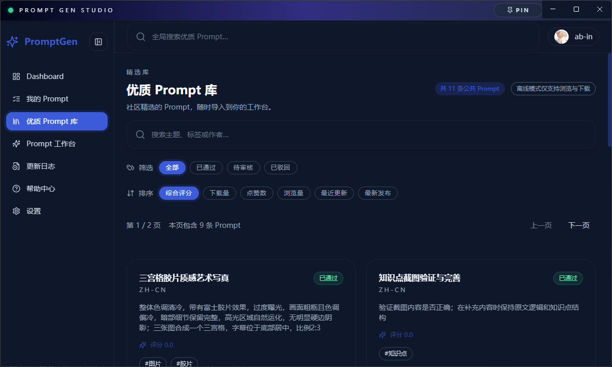
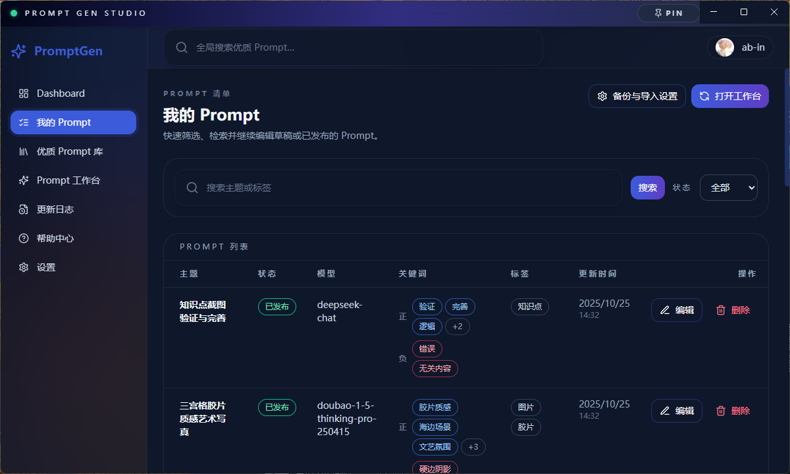
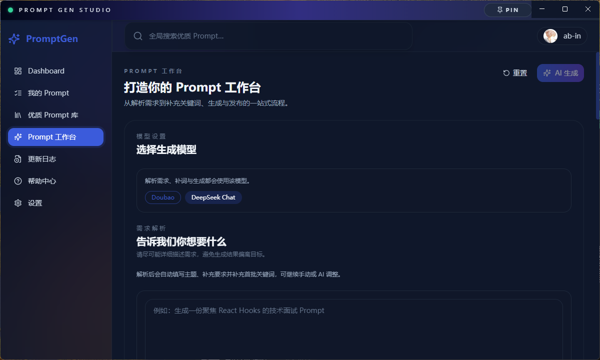
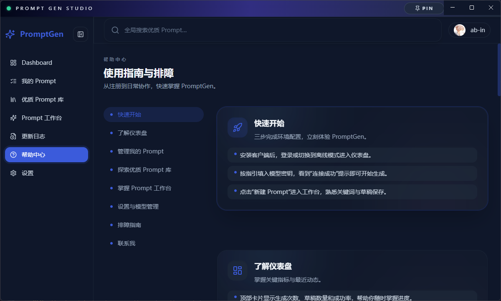

# Prompt Gen Desktop


[![zread](https://img.shields.io/badge/Ask_Zread-_.svg?style=flat&color=00b0aa&labelColor=000000&logo=data%3Aimage%2Fsvg%2Bxml%3Bbase64%2CPHN2ZyB3aWR0aD0iMTYiIGhlaWdodD0iMTYiIHZpZXdCb3g9IjAgMCAxNiAxNiIgZmlsbD0ibm9uZSIgeG1sbnM9Imh0dHA6Ly93d3cudzMub3JnLzIwMDAvc3ZnIj4KPHBhdGggZD0iTTQuOTYxNTYgMS42MDAxSDIuMjQxNTZDMS44ODgxIDEuNjAwMSAxLjYwMTU2IDEuODg2NjQgMS42MDE1NiAyLjI0MDFWNC45NjAxQzEuNjAxNTYgNS4zMTM1NiAxLjg4ODEgNS42MDAxIDIuMjQxNTYgNS42MDAxSDQuOTYxNTZDNS4zMTUwMiA1LjYwMDEgNS42MDE1NiA1LjMxMzU2IDUuNjAxNTYgNC45NjAxVjIuMjQwMUM1LjYwMTU2IDEuODg2NjQgNS4zMTUwMiAxLjYwMDEgNC45NjE1NiAxLjYwMDFaIiBmaWxsPSIjZmZmIi8%2BCjxwYXRoIGQ9Ik00Ljk2MTU2IDEwLjM5OTlIMi4yNDE1NkMxLjg4ODEgMTAuMzk5OSAxLjYwMTU2IDEwLjY4NjQgMS42MDE1NiAxMS4wMzk5VjEzLjc1OTlDMS42MDE1NiAxNC4xMTM0IDEuODg4MSAxNC4zOTk5IDIuMjQxNTYgMTQuMzk5OUg0Ljk2MTU2QzUuMzE1MDIgMTQuMzk5OSA1LjYwMTU2IDE0LjExMzQgNS42MDE1NiAxMy43NTk5VjExLjAzOTlDNS42MDE1NiAxMC42ODY0IDUuMzE1MDIgMTAuMzk5OSA0Ljk2MTU2IDEwLjM5OTlaIiBmaWxsPSIjZmZmIi8%2BCjxwYXRoIGQ9Ik0xMy43NTg0IDEuNjAwMUgxMS4wMzg0QzEwLjY4NSAxLjYwMDEgMTAuMzk4NCAxLjg4NjY0IDEwLjM5ODQgMi4yNDAxVjQuOTYwMUMxMC4zOTg0IDUuMzEzNTYgMTAuNjg1IDUuNjAwMSAxMS4wMzg0IDUuNjAwMUgxMy43NTg0QzE0LjExMTkgNS42MDAxIDE0LjM5ODQgNS4zMTM1NiAxNC4zOTg0IDQuOTYwMVYyLjI0MDFDMTQuMzk4NCAxLjg4NjY0IDE0LjExMTkgMS42MDAxIDEzLjc1ODQgMS42MDAxWiIgZmlsbD0iI2ZmZiIvPgo8cGF0aCBkPSJNNCAxMkwxMiA0TDQgMTJaIiBmaWxsPSIjZmZmIi8%2BCjxwYXRoIGQ9Ik00IDEyTDEyIDQiIHN0cm9rZT0iI2ZmZiIgc3Ryb2tlLXdpZHRoPSIxLjUiIHN0cm9rZS1saW5lY2FwPSJyb3VuZCIvPgo8L3N2Zz4K&logoColor=ffffff)](https://zread.ai/AB-IN-lsy/Prompt-Gen)

Prompt Gen Desktop 是一款专为内容创作者打造的桌面提示词管家。从灵感梳理、关键词治理到版本发布，全流程都能在几分钟内完成；就算离线也能继续整理 Prompt 资产，并随时导出备份与日志。

## 核心亮点

- **5 分钟产出 Prompt**：输入场景后即可获得结构化 Prompt，历史记录会自动追踪，方便随时复用。
- **关键词随手调音**：正向/负向关键词支持拖拽排序、权重调整与模型推荐，调优过程完全可视化。
- **版本管理不迷路**：草稿自动保存，发布后可回看最近版本并一键回滚，适合迭代式创作。
- **离线也能信任**：本地 SQLite 存储与 JSON 备份让数据牢牢掌握在自己手里，导入导出只需一键。
- **公共 Prompt 透明**：公共 Prompt 的发布与审核记录都会同步展示，结合操作日志与导入导出明细，团队协作更放心。
- **开箱体验额度**：在线模式内置 DeepSeek 免费体验模型，为未配置凭据的新用户提供每日有限的解析/生成次数，超出后可随时添加自有模型继续创作。

## 演示视频

<video src="https://github.com/AB-IN-lsy/Prompt-Gen/raw/main/docs/assets/demo1.mp4" controls width="70%">
  你的浏览器不支持内嵌播放，请下载 <a href="https://github.com/AB-IN-lsy/Prompt-Gen/raw/main/docs/assets/demo1.mp4">demo1.mp4</a> 查看。
</video>

<https://github.com/user-attachments/assets/f01924c4-4fdd-40b5-8ab3-1ec1999fb416>

<video src="https://github.com/AB-IN-lsy/Prompt-Gen/raw/main/docs/assets/demo2.mp4" controls width="70%">
  你的浏览器不支持内嵌播放，请下载 <a href="https://github.com/AB-IN-lsy/Prompt-Gen/raw/main/docs/assets/demo2.mp4">demo2.mp4</a> 查看。
</video>

<https://github.com/user-attachments/assets/6ceaa86c-10e8-4e5f-a208-89dee8090876>

> 若在 GitHub 页面无法直接播放，请右键链接选择“在新标签页打开”，或至本地仓库的 `docs/assets/` 目录离线查看。

### 界面预览











## 发布形态

| 形态 | 说明 |
| --- | --- |
| **离线版本** | 已发布的 Windows / macOS 安装包存放于仓库的 `release/`，内置后端服务与前端资源，安装后即可在本地离线使用。推荐在环境变量中将 `LOCAL_SQLITE_PATH` 指向用户目录，确保卸载时数据不会被清除。 |
| **在线版本** | 访问 <https://prompt.ab-in.cn/> 可进行轻度在线体验；云端部署计划中的网络版接口与控制台仍在内部筹备阶段，正式上线时间会在项目公告中另行通知。 |

> 发行包的默认配置面向离线体验，在线部署请等待官方发布的托管环境；若需自行体验在线形态，可参照下文的开发者指引自行搭建服务端与前端。  
> 如需将本项目用于二次开发或商业化，请先阅读并遵守仓库内的 [LICENSE](LICENSE)。所有衍生工作需保留版权声明并遵守协议要求。

## 项目结构

```text
.
├── backend/                  # Go HTTP 服务（cmd、internal、tests）
├── frontend/                 # Vite/React 前端源码与构建脚本
├── main.js / preload.js      # Electron 主进程及预加载脚本
├── release/                  # 离线安装包输出目录
├── docs/ · design/           # 设计与文档资料
├── .env.example              # 统一环境变量模板
└── README.md                 # 当前文件
```

## 快速体验（离线安装包）

1. 打开仓库的 “Releases” 页面，下载对应平台的最新安装程序。
2. 按安装向导操作，默认会安装到 `%LOCALAPPDATA%\Programs\PromptGen`（Windows）或 `/Applications`（macOS）。
3. 安装完成后即可直接启动客户端。若需要长期保留数据，建议将 `LOCAL_SQLITE_PATH` 配置到个人目录（如 `~/.promptgen/`），避免因卸载而丢失数据库和头像。

### 托盘与关闭行为

- **窗口关闭策略可自定义**：在 Windows 等桌面系统中，首次点击关闭按钮会弹出自定义毛玻璃小窗，询问“最小化到托盘”或“直接退出”，并支持“记住我的选择”。该偏好会写入用户数据目录下的 `promptgen-preferences.json`，后续按所选策略执行。
- **系统托盘入口**：应用默认常驻托盘（任务栏右下角/菜单栏），双击或左键单击托盘图标即可重新唤起主窗口。
- **托盘菜单快捷操作**：右键托盘图标可查看当前版本号、切换关闭策略、快速打开主界面或直接退出应用，方便在后台运行时管理实例状态。
- **后台提醒**：首次最小化到托盘后会通过通知气泡提示“应用已在后台运行”，防止用户误以为程序退出。

## 开发者指南

下述步骤适用于希望克隆本仓库并继续迭代功能的开发者。请务必先阅读 [LICENSE](LICENSE) 与 `AGENTS.md` 中的协作约定，确保贡献方式与使用范围符合协议。Prompt Gen Desktop 采用 Electron + Go + Vite/React 的一体化架构，下面提供给开发者的安装调试指引。

> ⭐ 建议同时阅读《[开发与发布流程指引](development-workflow.md)》，其中涵盖离线数据导出、版本号管理、`scripts/deploy-online.sh` 服务器部署等完整流程。

### 前提依赖

- Node.js ≥ 18（建议使用与 `.nvmrc` 对齐的版本）  
- Go ≥ 1.24
- pnpm / npm（任选其一，用于安装前端依赖）
- 可选：MySQL、Redis、Nacos，仅在在线模式或完整功能调试时需要

### 克隆与安装

```bash
git clone https://github.com/AB-IN-lsy/Prompt-Gen
cd Prompt-Gen

# 安装 Electron 主程与脚本依赖
npm install

# 安装前端依赖
npm --prefix frontend install

# 同步 Go 依赖
go mod tidy
```

### 环境配置

1. 复制 `.env.example` 为 `.env.local`（可根据需要提交 `.env`）。
2. 基本字段包括：`APP_MODE`、`LOCAL_SQLITE_PATH`、`JWT_SECRET`、`MODEL_CREDENTIAL_MASTER_KEY`（用于 AES-256-GCM 加密模型凭据，需填入 Base64 编码的 32 字节密钥）等。  
3. 若需调试在线模式，可补充 MySQL、Redis、Nacos 等连接参数；否则将 `APP_MODE=local` 即可在完全离线的 SQLite 环境中启动。
4. 前端同样读取根目录 `.env(.local)` 中的 `VITE_` 字段，例如 `VITE_API_BASE_URL`、`VITE_API_REQUEST_TIMEOUT_MS` 等。
5. 若需要部署到纯 Web 环境，可在 `.env` 中设置 `VITE_PUBLIC_BASE_PATH=/`；打包桌面壳保持默认的 `./` 即可兼容 `file://` 协议。
6. 当前版本仅提供本地存储加手动的 JSON 导入/导出备份能力，不再包含任何远程同步功能。

详细参数说明与约束请参考 `backend/backend_README.md` 与 `frontend/frontend_README.md`。

### 本地运行

```bash
# 启动后端 HTTP 服务（默认 9090）
go run ./backend/cmd/server

# 启动前端 Vite 开发服务器（默认 5173）
npm run dev:frontend

# 启动 Electron 桌面壳（加载 Vite Dev URL）
npm start
```

> 提示：`npm start` 通过 `scripts/start-electron.cjs` 调用本地安装的 Electron，可避免 Windows 上 `'electron' 不是内部命令'` 的报错；首次运行请确保已执行 `npm install`。

构建生产资源：

```bash
npm run build:frontend:web   # 生成部署 Web 的前端静态文件（base=/）
npm run build:frontend       # 生成 Electron 壳使用的前端资产（保留相对路径 base=./）
npm run prepare:offline      # 同时构建前端与后端二进制
npm run dist:win             # 生成 Windows 安装包（macOS 对应 dist:mac）
```

### 质量检查

```bash
# 前端静态检查
npm --prefix frontend run lint
npm --prefix frontend run build

# 后端测试套件
go test ./...
go test -tags=integration ./backend/tests/integration   # 需要真实依赖
go test -tags=e2e ./backend/tests/e2e                   # 命中线上接口时再运行
```

### 数据导出 / 导入

- `POST /api/prompts/export`：导出当前用户的 Prompt，Electron 客户端会在“我的 Prompt”页面提供按钮并显示导出路径。
- `POST /api/prompts/import`：上传导出的 JSON 文件，可合并或覆盖现有 Prompt；前端会展示导入统计以及失败条目列表，便于逐项修复。

### 离线预置数据更新

- 安装包会随带 `backend/data/bootstrap/` 下的 `public_prompts.json` 与 `changelog_entries.json`，空表启动时后端子进程会自动导入这些预置数据。
- 发布前请执行：

  ```bash
  go run ./backend/cmd/export-offline-data -output-dir backend/data/bootstrap
  ```

  命令会使用 `.env(.local)` 中的线上数据库配置导出最新公共 Prompt 与 changelog，并覆盖目录内 JSON。
- 如需确认导入效果，可运行：

  ```bash
  go run ./backend/cmd/offline-bootstrap -output ./release/assets/promptgen-offline.db
  ```

  CLI 会根据 JSON 生成一个 SQLite 文件并打印条目统计；将 `LOCAL_SQLITE_PATH` 指向该文件或清空现有数据库后重启客户端即可验证页面展示。
- 更新 JSON 后记得纳入提交（`.gitignore` 已放行该目录），再执行 `npm run dist:win` / `npm run dist:mac` 检查安装包内 `resources/app/backend/data/bootstrap/` 是否包含最新文件。

## 常用脚本速查

| 命令 | 作用 |
| --- | --- |
| `npm run dev:frontend` | 启动前端开发服务器 |
| `npm start` | 打开 Electron 客户端（开发模式） |
| `npm run prepare:offline` | 构建离线包所需的前后端资源 |
| `npm run dist:win` / `npm run dist:mac` | 打包发布版安装程序 |
| `go run ./backend/cmd/server` | 启动 Go API 服务 |
| `go test ./...` | 运行后端单元测试 |

## 贡献与支持

- 如有功能建议或缺陷反馈，请通过 Issue 进行描述，并附带复现步骤或日志。  
- Pull Request 应遵循仓库现有的提交规范与编码风格，重要改动需附上相应的测试或截图。  
- 若计划将本项目用于商业用途或深度定制，请提前阅读许可证条款，必要时联系维护者获取授权或协助。

## 许可证

本项目依据仓库中的 [LICENSE](LICENSE) 发布。使用、分发或再次开发时请遵守相关条款，并在文档、产品页面及二次发行包中保留原始版权声明。


## Star History

[](https://www.star-history.com/#AB-IN-lsy/Prompt-Gen&type=date&legend=top-left)
